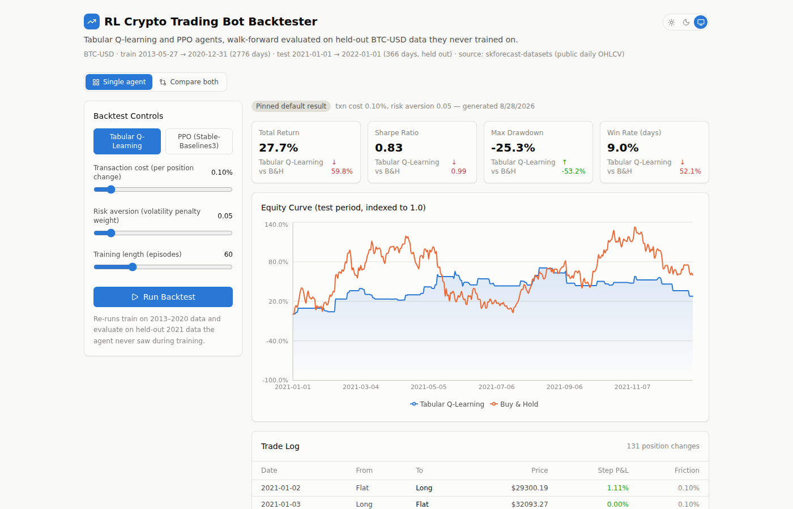

# Crypto RL Backtester

A full-stack app for training and backtesting reinforcement-learning trading
agents on real historical BTC-USD data. Two agents — a **tabular Q-learning**
agent implemented from scratch in NumPy, and a **PPO** agent via
Stable-Baselines3 — are trained on 2013–2020 data and evaluated on a held-out
2021 test period they never see during training. A React dashboard lets you
tweak transaction costs, a risk-aversion reward penalty, and training length,
kick off a fresh training run, and watch the equity curve and trade log come
back in real time — with a side-by-side "Compare both agents" view, animated
stat tiles, and a light/dark/system theme toggle.



**This is a backtesting research tool, not investment advice**, and none of
the numbers below should be read as "this strategy works." See
[Methodology & Limitations](#methodology--limitations) before drawing any
conclusions from the results.

## Why two agents

Tabular Q-learning can't consume a continuous, multi-dimensional observation
directly — the state space would be uncountable — so it needs hand-picked,
discretized features (here: trend, momentum, volatility, each binned into
3 buckets, plus position → 81 states). PPO has no such restriction; it
consumes the full 9-dimensional engineered feature vector directly through a
neural network policy. The project deliberately keeps both agents side by
side so the dashboard shows that trade-off directly, not just two numbers.

## Architecture

```
┌─────────────────┐      ┌──────────────────────────┐      ┌────────────────┐
│  React frontend  │──────▶  FastAPI backend          │──────▶  Trained agent  │
│  (Vite + TS +    │ REST │  /api/baseline             │      │  (Q-table json  │
│  Tailwind +      │◀─────│  /api/train (async job)    │◀─────│   or PPO .zip)  │
│  Recharts)        │      │  /api/jobs/{id}(/results)  │      │                │
└─────────────────┘      └──────────────────────────┘      └────────────────┘
                                        │
                                        ▼
                          ┌──────────────────────────┐
                          │ Gymnasium TradingEnv       │
                          │ (custom, single-asset,     │
                          │  discrete long/flat/short)  │
                          └──────────────────────────┘
                                        │
                                        ▼
                          ┌──────────────────────────┐
                          │ Feature engineering         │
                          │ (returns, SMA/EMA ratios,   │
                          │  RSI, volatility, MACD,     │
                          │  Bollinger position)         │
                          └──────────────────────────┘
                                        │
                                        ▼
                          ┌──────────────────────────┐
                          │ data/btc_daily.csv           │
                          │ real daily OHLCV, 2013–2022  │
                          └──────────────────────────┘
```

## Tech stack

- **Backend**: Python, FastAPI, Gymnasium, NumPy/Pandas, Stable-Baselines3 + PyTorch (PPO)
- **Frontend**: React, TypeScript, Vite, Tailwind CSS v4, Recharts
- **Data**: real daily BTC-USD OHLCV (2013-04-28 → 2022-01-01), sourced from the
  [skforecast-datasets](https://github.com/skforecast/skforecast-datasets) public dataset repo — not synthetic/simulated data

## Project layout

```
backend/
  app/
    data/features.py       # technical-indicator feature engineering
    env/trading_env.py     # custom Gymnasium environment
    agents/q_learning.py   # tabular Q-learning, from scratch
    agents/ppo_agent.py    # PPO via Stable-Baselines3 + VecNormalize
    backtest/engine.py     # walk-forward backtest + metrics
    api/main.py            # FastAPI app
    jobs/manager.py        # in-memory async job runner
  scripts/
    fetch_data.py                  # pulls real OHLCV data into data/
    generate_default_results.py    # trains both agents, pins results/default.json
  results/default.json     # pinned demo results (checked in)
  models/                  # trained model artifacts (checked in, all <200KB)
frontend/
  src/
    components/            # EquityCurveChart, MetricsCards, TradeLogTable, ControlsPanel
    lib/api.ts              # typed fetch client + job polling
    App.tsx
data/btc_daily.csv         # real historical OHLCV data
```

## Running it locally

### Backend

```bash
cd backend
python3 -m venv .venv && source .venv/bin/activate
pip install -r requirements.txt

# (data/btc_daily.csv and results/default.json are already checked in --
#  only re-run these if you want to refresh them)
python scripts/fetch_data.py
python scripts/generate_default_results.py

uvicorn app.api.main:app --reload --port 8000
```

### Frontend

```bash
cd frontend
npm install
npm run dev
```

Open http://localhost:5173 — the Vite dev server proxies `/api/*` to
`localhost:8000`, so both need to be running.

## Methodology & limitations

This section exists because "an RL agent backtested against historical
prices" is easy to get subtly wrong in ways that make results look better
than they are. Here's what this project does about that, and what it
doesn't:

- **Walk-forward split, not cross-validation.** Both agents train only on
  2013-05-27 → 2020-12-31 and are evaluated only on 2021-01-01 → 2022-01-01,
  a period neither agent's parameters were ever fit on. The Q-learning
  discretization bin edges are also fit only on the training split.
- **Causal features.** Every technical indicator is computed using only
  data up to and including the current bar — no lookahead into future
  prices when the agent makes a decision.
- **Transaction costs are modeled**, not ignored: every position change
  costs `transaction_cost` (default 10bps) against the position size
  change, and this is included in both the training reward and the
  reported backtest returns.
- **A risk-aversion term is in the reward function**, not just return —
  `risk_aversion * position² * trailing_volatility` is subtracted each
  step, which is exactly why the Q-learning agent below shows a
  meaningfully smaller drawdown than buy-and-hold at the cost of lower
  raw return: that's a real, visible risk/return trade-off, not noise.
- **Observation/reward normalization (VecNormalize) matters for PPO.**
  Raw per-step rewards here are tiny fractions (roughly ±0.001 to ±0.05),
  which gives PPO's default hyperparameters a weak gradient signal without
  normalization. This project fits a `VecNormalize` wrapper during training
  and freezes+reuses its statistics at inference time — an easy detail to
  get wrong (normalizing at eval with training-time-updating statistics, or
  forgetting to persist them at all, silently breaks the policy).
- **What this does *not* do:** results below come from a single training
  seed and a single train/test split on a single asset. There's no
  multi-seed averaging, no cross-asset validation (ETH, equities), and no
  slippage/market-impact model beyond the flat transaction-cost fee. A
  rigorous version of this project would run multiple seeds and multiple
  walk-forward windows and report a distribution, not a point estimate.
  Treat the numbers below as "here's what happened in one real backtest,"
  not "here's the expected performance of this strategy."

## Results (pinned default run)

Test period: 2021-01-01 → 2022-01-01 (366 days). Transaction cost 0.10%,
risk aversion 0.05. Full run: `backend/scripts/generate_default_results.py`.

| Agent | Total Return | Sharpe | Max Drawdown | Trades |
|---|---|---|---|---|
| Buy & Hold | +59.8% | 0.99 | -53.2% | — |
| Tabular Q-Learning | +27.7% | 0.83 | **-25.3%** | 131 |
| PPO (Stable-Baselines3) | **+75.7%** | **1.16** | -60.1% | 54 |

Read this as: neither agent "beats the market" unambiguously. Q-learning
trades away upside for a much shallower drawdown (a real risk-management
result from the reward shaping). PPO found a policy with higher return and
a better Sharpe ratio than buy-and-hold in this specific backtest, but with
similar-or-worse drawdown — and per the limitations above, that's one run
on one seed, not a validated edge.

## Possible extensions

- Multi-seed training with confidence intervals on the metrics
- A second asset (ETH) and a portfolio-level agent
- Slippage/market-impact modeling beyond a flat fee
- A DQN agent (SB3 supports it out of the box) as a third comparison point
- Rolling walk-forward windows instead of a single train/test split

## License

MIT
